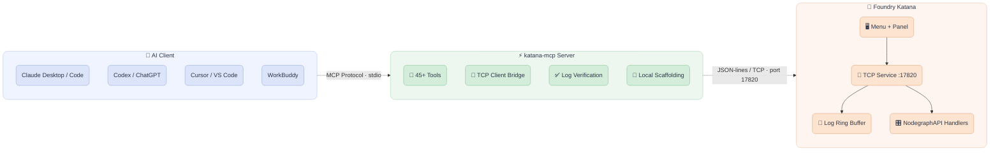

# katana-mcp

An [MCP (Model Context Protocol)](https://modelcontextprotocol.io) bridge for
**Foundry Katana**. Katana does not ship an official MCP interface — this
project adds one, so AI assistants (Claude, Codex, ChatGPT, WorkBuddy,
Cursor, ...) can talk directly to a running Katana session:

- **Read logs** — application messages, script output and render output
  printed to the console, captured in a ring buffer inside Katana
- **Execute Python** inside Katana's interpreter (with `NodegraphAPI`, `UI4`,
  `Utils`, `KatanaFile` pre-imported)
- **Full node graph editing** — create/delete/rename/duplicate nodes, get/set
  parameters, connect ports, search, tree views, positions, auto-layout,
  backdrops and node notes
- **Project management** — new/open/save projects, read & write Project
  Settings, Graph State Variables
- **Templates** — export a set of nodes (types, parameter values, positions,
  connections) as a reusable JSON template and instantiate it anywhere
- **Scene graph browsing & render triggering**
- **Verification** — run an action, then automatically scan the log output it
  produced for errors, warnings and tracebacks
- **Local scaffolding** — generate launcher `.bat` files with full
  environment setup, project directory trees, SuperTool / panel / Python
  tool skeletons (no Katana connection required)

## Architecture



- `katana/` — the in-Katana plugin. Adds a **Katana MCP** main-menu entry and
  a **Katana MCP** tab (panel) with Start/Stop controls, port setting and a
  live log view. The service only listens on `127.0.0.1`.
- `mcp_server/` — the MCP server package your AI client launches. It connects
  to the in-Katana service and exposes everything as MCP tools.

## Installation

### 1. Katana side (plugin)

Add the `katana/` directory of this repository to your `KATANA_RESOURCES`
environment variable (semicolon-separated on Windows, colon on Linux):

```powershell
# Windows example
$env:KATANA_RESOURCES = "C:\path\to\katana-mcp\katana;$env:KATANA_RESOURCES"
```

```bash
# Linux example
export KATANA_RESOURCES=/path/to/katana-mcp/katana:$KATANA_RESOURCES
```

Launch Katana. You should see a **Katana MCP** menu and be able to open the
panel via the menu entry or `Tabs > Katana MCP`. Click **Start MCP Service**
(default port `17820`). Or set `KATANA_MCP_AUTOSTART=1` and skip the click —
the `katana_create_launcher_bat` tool can generate a launcher that does all
of this for you.

Optional environment variables:

| Variable              | Effect                                        |
|-----------------------|-----------------------------------------------|
| `KATANA_MCP_AUTOSTART`| Set to `1` to start the service on launch     |
| `KATANA_MCP_PORT`     | Default port (fallback: `17820`)              |

### 2. MCP server side (AI client)

No manual install needed if your client supports `uvx`. Add this to your MCP
configuration (e.g. Claude Desktop `claude_desktop_config.json`, or
WorkBuddy's `~/.workbuddy/mcp.json`):

```json
{
  "mcpServers": {
    "katana": {
      "command": "uvx",
      "args": [
        "--from",
        "git+https://github.com/duchengbin-cg/katana-mcp#subdirectory=mcp_server",
        "katana-mcp"
      ]
    }
  }
}
```

Or install from a local checkout:

```bash
pip install -e ./mcp_server
# then configure your client with:
#   "command": "katana-mcp"
```

Connection settings (env vars for the MCP server process):

| Variable          | Default       |
|-------------------|---------------|
| `KATANA_MCP_HOST` | `127.0.0.1`   |
| `KATANA_MCP_PORT` | `17820`       |

## Tool reference

### Status, logs & execution
| Tool | Purpose |
|---|---|
| `katana_status` | Connectivity check + Katana/project info |
| `katana_get_logs` / `katana_clear_logs` | Read / clear captured log entries (level filter supported) |
| `katana_execute_python` / `katana_eval` | Run Python inside Katana (`result` variable is returned) |
| `katana_verify` | Execute code and scan the logs it produced for errors — the "did it actually work?" tool |

### Node graph
| Tool | Purpose |
|---|---|
| `katana_create_node` / `katana_delete_node` / `katana_rename_node` / `katana_duplicate_node` | Node lifecycle (duplicate keeps parameters + incoming connections) |
| `katana_list_nodes` / `katana_get_node_tree` / `katana_find_nodes` / `katana_get_node_info` / `katana_get_node_types` | Inspection & search |
| `katana_set_parameter` / `katana_get_parameter` | Parameter editing (dot paths for nesting, e.g. `resolution.x`) |
| `katana_connect_nodes` / `katana_disconnect_nodes` | Port wiring |
| `katana_select_nodes` / `katana_get_selected_nodes` / `katana_set_node_position` | Selection & positions |
| `katana_arrange_nodes` | Auto-layout into layers by connection depth |
| `katana_create_backdrop` | Backdrop nodes for visual grouping |
| `katana_set_node_note` / `katana_get_node_note` | Persistent text annotations on nodes |

### Project, settings & environment
| Tool | Purpose |
|---|---|
| `katana_new_project` / `katana_open_project` / `katana_save_project` | Project files |
| `katana_get_project_settings` / `katana_set_project_setting` | Project Settings tab parameters (frame range, resolution, ...) |
| `katana_get_gsv` / `katana_set_gsv` | Graph State Variables |
| `katana_get_env` / `katana_set_env` | Environment variables of the running Katana process |

### Scene graph, render & templates
| Tool | Purpose |
|---|---|
| `katana_get_scene_graph` | Browse scene graph locations |
| `katana_render_node` | Trigger preview / live render, then check `katana_verify` |
| `katana_save_template` / `katana_apply_template` / `katana_list_templates` / `katana_delete_template` | Reusable node-group templates |

### Local scaffolding (no Katana needed)
| Tool | Purpose |
|---|---|
| `katana_create_launcher_bat` | Generate a Windows `.bat`: env vars + KATANA_RESOURCES + MCP autostart + optional project |
| `katana_scaffold_project_directory` | Standard VFX project directory tree |
| `katana_scaffold_supertool` | PackageSuperToolAPI `Node.py` + Qt `Editor.py` skeleton |
| `katana_scaffold_panel_tool` | KatanaPanel tab skeleton |
| `katana_scaffold_python_tool` | Startup-menu tool or importable shelf script |

### Knowledge / skill guides (no Katana needed)
| Tool | Purpose |
|---|---|
| `load_katana_skill` | Load a pipeline skill guide by category — call it **before** building any node graph so generated code follows the verified spec (node types, parameter paths, `NodegraphAPI` blueprints, pitfalls). Categories: `lookdev` (materials / LookFile), `shot_assembly` (asset referencing, USD/Alembic scene tree, camera alignment), `lighting` (GafferThree packages, AOV / RenderPass strategy), `batch` (GSV multi-shot overrides, `katana --batch`, farm dispatch). All four guides were distilled from 42 official Katana example projects and verified against a live Katana 9.0v1 session. Sources: [`skills/`](skills) |
| `get_lookdev_skill_guide` | Shortcut for `load_katana_skill('lookdev')`. Source: [`skills/katana_lookdev_skill.md`](skills/katana_lookdev_skill.md) |

Router index (which guide the agent should load):

| Task involves… | Category |
|---|---|
| Asset texture/material binding, LookFile generation | `lookdev` |
| Assembling shots, importing Alembic/USD scene trees | `shot_assembly` |
| Lighting, GafferThree, AOV passes | `lighting` |
| GSV switching, multi-shot batch renders, farm submission | `batch` |

### Example: full project bootstrap in one conversation

> "Set up a new Katana project called `sh010_lighting` on my Z: drive:
> project directories, a launcher bat with the Arnold env, then open Katana,
> build a template lighting rig (camera, gaffer, merge, render settings),
> arrange the nodes, add a backdrop saying HERO RIG, save it as a template,
> set the frame range 1001-1100, and verify nothing errored."

The assistant can chain: `katana_scaffold_project_directory` →
`katana_create_launcher_bat` → (after you launch Katana)
`katana_create_node` ×4 → `katana_connect_nodes` → `katana_arrange_nodes` →
`katana_create_backdrop` → `katana_save_template` →
`katana_set_project_setting` → `katana_verify`.

## Testing without Katana

A mock service speaks the same wire protocol:

```bash
python scripts/mock_katana.py   # listens on 127.0.0.1:17820
```

Point the MCP server at it and all connection/log/tool plumbing can be
developed without launching Katana.

## Security notes

- The in-Katana service binds to **127.0.0.1 only** by design.
- `katana_execute_python` runs arbitrary code inside Katana — that is the
  point of the tool, but treat the MCP server as trusted, same as giving
  someone access to Katana's Python shelf.
- `katana_open_project` / `katana_new_project` discard unsaved changes.

## Compatibility

| Katana | Python | Qt binding | Notes |
|---|---|---|---|
| 5.x – 7.x | 3.7 – 3.10 | PySide2 (Qt 5) | Qt shim falls back automatically |
| 8.x | 3.11 | PySide6 (Qt 6.5) | VFX Reference Platform CY2024 |
| **9.x** | **3.11 (3.11.11)** | **PySide6 (Qt 6.5.3)** | **VFX Reference Platform CY2025, USD 25.08 — primary target** |

- The plugin's Qt shim auto-detects PySide6 / PySide2, so one codebase runs
  on all supported versions. `katana_status` reports the detected Python
  version and Qt binding inside your session.
- **Katana 9.0 notes**: everything in this repo is pure Python ≥ 3.9 syntax
  and runs on 9.0's Python 3.11. The new native-USD node types
  (`UsdSuperLayer`, `UsdGaffer`, `UsdMaterial`, `Usd*Create` prims) are
  regular node types — discover them with
  `katana_get_node_types(filter="Usd")` and build with `katana_create_node`.
  `katana_get_env` also surfaces USD/PXR/FN_/MaterialX variables.
- Version-sensitive APIs (backdrop extents, render entry points, scene
  graph) are probed at runtime and report honestly if a Katana release
  lacks them.
- MCP server: Python ≥ 3.9, depends only on the official `mcp` package

## Roadmap

- Bidirectional event push (node graph changes → AI), inspired by houdini-mcp
- Workflow recipe library (e.g. "build a lookdev turntable setup")
- Expression / CEL helpers, macro & LiveGroup support
- Render log streaming during renders

Contributions welcome — issues and PRs please!

## License

MIT
